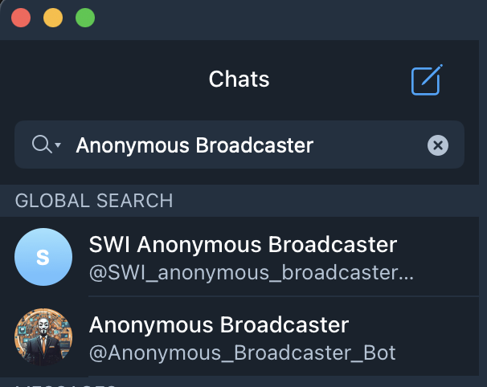
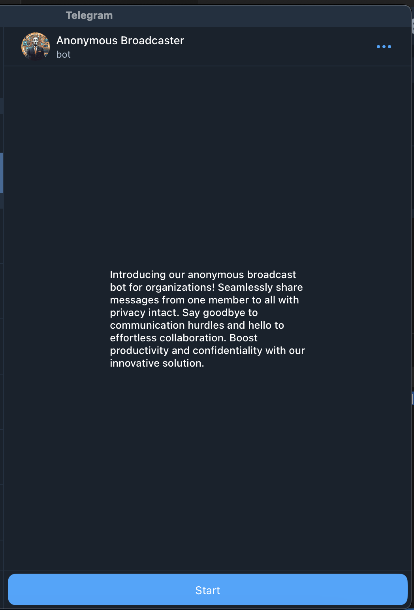
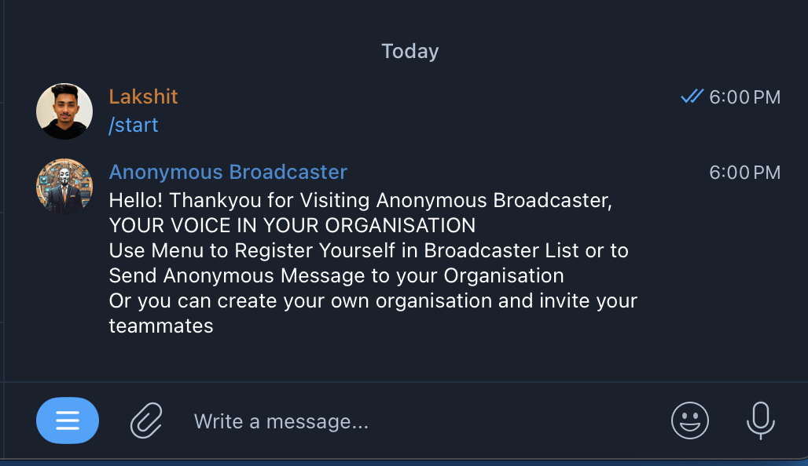
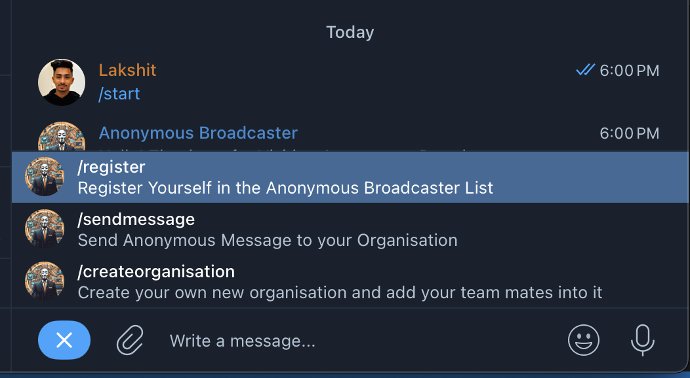

# Anonymous Message Broadcaster

## Installiation

 `pip3 install python-telegram-bot requests`

## Execution

`python3 main.py`

## Testing

- Search for Anonymous Broadcaster on Telegram and Select `@Anonymous_Broadcaster_Bot`

- Click on Start

- Click on Menu

- Now Utilise the Bot by Either Creating or Joining the Organisation or you can send anonymous message to your organisation
